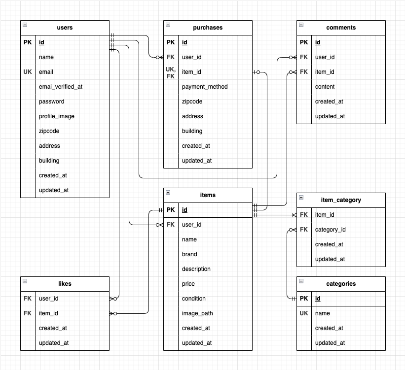

# coachtechフリマ(フリーマーケットアプリ)

## 環境構築
**Dockerビルド**
1. git clone https://github.com/m-sato310/makio-mogi1.git

2. DockerDesktopアプリを立ち上げる

3. `docker-compose up -d --build`

> *MacのM1・M2チップのPCの場合、`no matching manifest for linux/arm64/v8 in the manifest list entries`のメッセージが表示されビルドができないことがあります。
エラーが発生する場合は、docker-compose.ymlファイルの「mysql」内に「platform」の項目を追加で記載してください*
``` bash
mysql:
    platform: linux/x86_64(この文追加)
    image: mysql:8.0.26
    environment:
```

**Laravel環境構築**
1. `docker-compose exec php bash`

2. `composer install`

3. 「.env.example」ファイルを 「.env」ファイルに命名を変更。または、新しく.envファイルを作成

4. .envに以下の環境変数を追加
``` text
DB_CONNECTION=mysql
DB_HOST=mysql
DB_PORT=3306
DB_DATABASE=laravel_db
DB_USERNAME=laravel_user
DB_PASSWORD=laravel_pass
```

5. アプリケーションキーの作成
``` bash
php artisan key:generate
```

6. マイグレーションの実行
``` bash
php artisan migrate
```

7. シーディングの実行
``` bash
php artisan db:seed
```

## メール認証機能(新規ユーザー登録時)
使用サービス:Mailtrap https://mailtrap.io/

### メール送信設定
1. Mailtrapのアカウントにログイン後、ダッシュボードからUsernameとPasswordを確認  

2. 以下の設定を .env に記載
``` text
MAIL_MAILER=smtp
MAIL_HOST=sandbox.smtp.mailtrap.io
MAIL_PORT=2525
MAIL_USERNAME=（Mailtrapのダッシュボードで確認）
MAIL_PASSWORD=（同上）
MAIL_ENCRYPTION=tls
MAIL_FROM_ADDRESS=coachtech@example.com
MAIL_FROM_NAME="coachtechフリマ"
```

3. 設定後にPHPコンテナ内で下記コマンドを実行
``` bash
php artisan config:cache
```
※メール認証誘導画面の「認証はこちらから」押下でMailtrapのトップページに遷移します。ログイン後にinboxからメールを確認してください。

## Stripe決済機能
使用サービス:Stripe https://stripe.com/jp

### Stripe決済設定
1. stripeのアカウントにログイン後、ダッシュボードから「テストモード」のAPIキー（公開キー・シークレットキー）を取得

2. 以下の設定を.envに記載
``` text
STRIPE_KEY=（公開キー）
STRIPE_SECRET=（シークレットキー）
```

3. 設定後にPHPコンテナ内で下記コマンドを実行
```
composer require stripe/stripe-php
php artisan config:cache
```
※商品購入画面の「購入する」ボタン押下で購入自体は完了し、Stripe決済画面はその後に表示だけされるよう実装しています。

## 初期テストユーザー

| 名前            | メールアドレス         | パスワード     |
|-----------------|------------------------|----------------|
| テストユーザー1 | user1@example.com      | password111    |
| テストユーザー2 | user2@example.com      | password222    |
| テストユーザー3 | user3@example.com      | password333    |
| テストユーザー4 | user4@example.com      | password444    |
| テストユーザー5 | user5@example.com      | password555    |

## テスト実行手順
1. MySQLのコンテナIDを確認
```
docker ps
```

2. MySQLコンテナにアクセス
```
docker exec -it コンテナID bash
```

3. rootユーザーでログイン(パスワードには’root’と入力)
```
mysql -u root -p
```

4. テスト用データベースを作成(実行後ログアウトし、MySQLコンテナからも出る)
```
CREATE DATABASE test_db;
SHOW DATABASES;
```

5. テストを実行
```
docker-compose exec php bash
php artisan test tests/Feature
```

## 使用技術(実行環境)
- PHP8.3.0
- Laravel8.83.27
- MySQL8.0.29

## ER図


## URL
- 開発環境：http://localhost/
- phpMyAdmin:：http://localhost:8080/